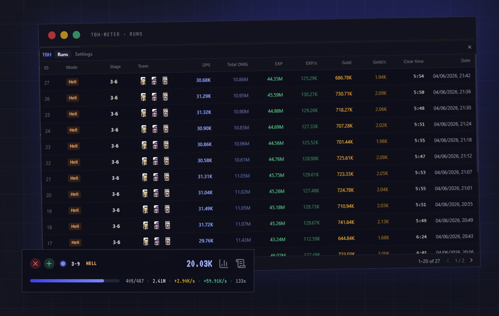

<div align="center">

# TBH Meter

**A live DPS / Gold / EXP meter & run tracker overlay for [Task Bar Hero](https://store.steampowered.com/)**

[](https://github.com/mad-labs-org/tbh-meter/releases/latest)
[](https://github.com/mad-labs-org/tbh-meter/releases)
[](https://github.com/mad-labs-org/tbh-meter/releases/latest)
[](https://buymeacoffee.com/viniarruda)




_Unaffiliated, open-source fan project — not made by or endorsed by the game's developer._

</div>

---

## What it does

TBH Meter is a lightweight, always-on-top overlay that tracks your **Task Bar Hero** runs in real time:

| Metric | Description |
| ------ | ----------- |
| **MODE** | Current run difficulty (Normal / Nightmare / Hell / Torment) |
| **STAGE** | Current stage and act |
| **DPS** | Live damage per second |
| **DAMAGE** | Total damage dealt this run |
| **MOBS** | Monsters killed / total |
| **TIME** | Elapsed run time |

Every finished run is also saved with full detail — result (success / fail / abandoned), gold & XP gained, gold/XP per second, and a complete snapshot of your heroes (class, level, items, mods, skills, stats) — browsable from the built-in **Runs** window.

## Install

> **Windows 10+ only.** The reader uses Windows APIs to read game memory.

1. Download **`tbh-meter-Setup-<version>.exe`** from the [**latest release**](https://github.com/mad-labs-org/tbh-meter/releases/latest).
2. Run the installer — **no admin rights needed** (it installs per-user).
3. Launch Task Bar Hero and TBH Meter in any order. The first attach takes **1–2 minutes**; after that, live stats appear automatically.

The app keeps itself up to date — it checks on launch and every 6 hours, downloads in the background, and offers a *Restart to update* prompt.

<details>
<summary><b>"Windows protected your PC" warning</b></summary>

The builds are **not code-signed** (signing is expensive for a free fan tool), so SmartScreen shows a blue warning the first time you run them. Click **More info → Run anyway**.
</details>

<details>
<summary><b>Antivirus flags <code>tbh-reader.exe</code></b></summary>

That is a **false positive**. `tbh-reader.exe` is the bundled game reader — it only *reads* memory, never writes to or modifies the game. Allow or restore it so the meter can work. See [SECURITY.md](./.github/SECURITY.md) for what the reader does.
</details>

## How it works

The meter ships as **two pieces** that talk over the filesystem:

```
 Task Bar Hero (game process)
        │  ReadProcessMemory (read-only)
        ▼
 reader/  ──►  tbh-reader.exe        a pure-Python "sensor": resolves IL2CPP classes and
        │                            writes one run record per finished run + a live feed
        ▼
 app/     ──►  tbh-meter (Electron)  converts runs, derives sessions, draws the overlay
        │                            + runs list, and (optionally) uploads to the leaderboard
        ▼
 api.tbherohelper.com                public HTTP — the separate wiki / leaderboard project
```

- **`reader/`** — the memory reader. Pure `ctypes` + stdlib (zero runtime dependencies), frozen into a single `tbh-reader.exe` with PyInstaller. A **read-only** sensor: it never modifies game memory, files, or behavior, and never injects code.
- **`app/`** — the Electron overlay. Owns everything user-facing: the live overlay, the runs list and detail views, session grouping, settings, Discord sign-in, the background uploader, and auto-update.

Your data is stored locally in **`~/tbh-meter/`** (configurable in Settings). Runs are uploaded **only** if you explicitly sign in to the leaderboard.

## Build from source

You need **Node 22 + pnpm** (app) and **Python 3.12** (reader). The live memory-reading path is **Windows-only**; on macOS/Linux you can run the app's UI, lint, and tests, but not attach to the game.

```bash
# App (Electron overlay)
cd app
pnpm install
pnpm dev          # run the overlay (macOS renders UI only — no game attach)
pnpm check        # eslint + tsc
pnpm test         # vitest
pnpm dist:win     # build the Windows installer (requires Windows)

# Reader (Python sensor)
cd reader
pip install ruff -r requirements-dev.txt
ruff check .
python -m pytest
```

The app bundles a small **game-data snapshot** (committed under [`data/`](./data)); `app/scripts/sync-data.mjs` copies it in at build time, so the app builds offline. See [CONTRIBUTING.md](./.github/CONTRIBUTING.md) to refresh it after a game patch.

## Contributing

Issues and PRs are welcome — start with [CONTRIBUTING.md](./.github/CONTRIBUTING.md) for setup, the test gates, and the release flow, and the [Code of Conduct](./.github/CODE_OF_CONDUCT.md). Found a security issue? See [SECURITY.md](./.github/SECURITY.md). Come say hi on [Discord](https://discord.gg/eYqUkxu3).

## Support

If TBH Meter helps your runs, consider buying the team a coffee — it keeps development going.

<div align="center">

[](https://buymeacoffee.com/viniarruda)

</div>

## License

[MIT](./LICENSE). Task Bar Hero and its assets belong to their respective owner; this project only reads publicly observable game state for the player's own use.
